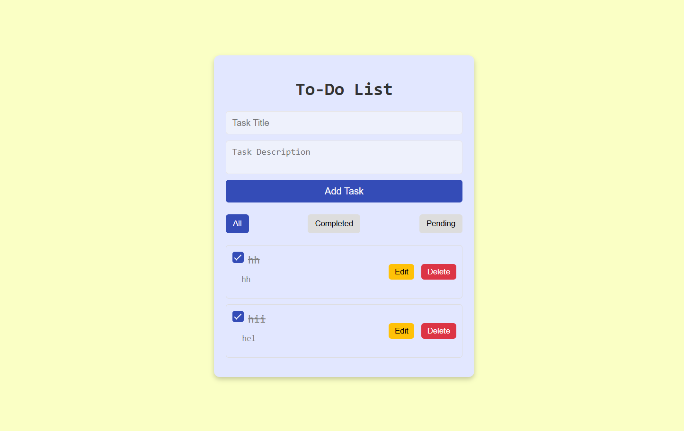

# To-Do List Application

This is a simple **To-Do List** application built using **HTML**, **CSS**, and **JavaScript**. It allows users to manage their tasks by adding, editing, marking them as completed, and deleting them. The tasks are persisted using **localStorage** so they remain even after page reloads. Users can also filter tasks based on their completion status.

## Features

- **Add, edit, and delete tasks.**
- **Mark tasks as completed** by checking the checkbox.
- **Filter tasks** based on completion status (All, Completed, Pending).
- **Persistent tasks** stored in `localStorage` so tasks remain after a page reload.

## Technologies Used

- **HTML5**: Structure of the app.
- **CSS3**: Styling the application.
- **JavaScript**: Handles core functionality, such as task addition, completion toggle, deletion, and filtering.
- **FontAwesome**: Used for adding icons to the buttons (edit and delete).

## How to Use

1. **Add a Task**:
   - Enter a Title and Description (optional) for the task in the input fields.
   - Click the "Add Task" button to add the task to the list.
   - The task will be stored in `localStorage`, ensuring it persists even after the page reloads.

2. **Mark a Task as Completed**:
   - Click the checkbox next to a task to mark it as completed.
   - Completed tasks will appear with a strikethrough.

3. **Edit a Task**:
   - Click the **Edit** button next to a task to modify its title or description.
   - Save the changes, and the task will be updated in both the list and `localStorage`.

4. **Delete a Task**:
   - Click the **Delete** button next to a task to remove it from the list.
   - The task will be removed from both the list and `localStorage`.

5. **Filter Tasks**:
   - Filter tasks based on completion status (All, Completed, Pending).

## Project Structure

```plaintext
- index.html  --> Contains the structure of the application (task input, list of tasks, and filter options).
- styles.css  --> Styles the user interface, providing a clean, user-friendly design.
- app.js      --> Handles core functionality:
  - Add new tasks
  - Mark tasks as completed
  - Edit tasks
  - Delete tasks
  - Filter tasks
  - Tasks are stored in localStorage for persistence
```
## Screenshot
<div>
  
</div>